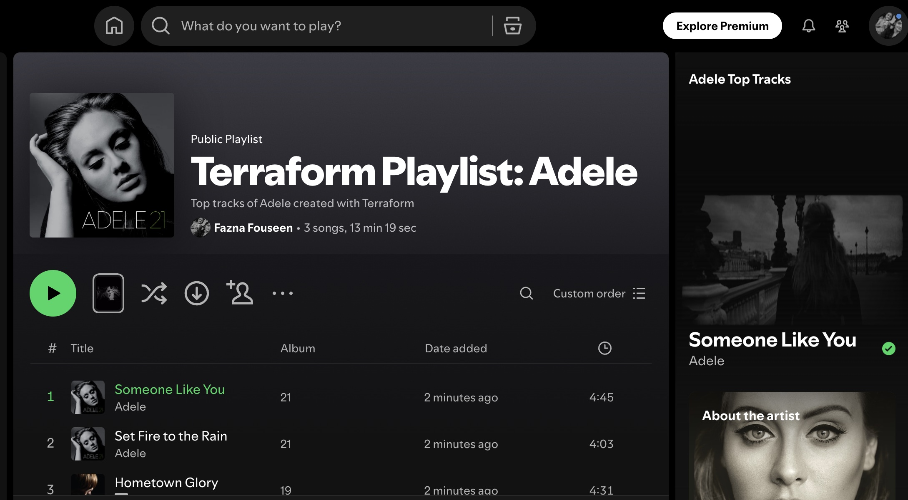
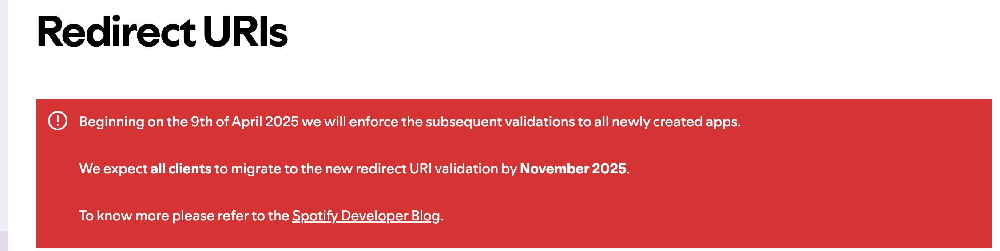

# Spotify Playlist Creator with Terraform 




This project combines **Terraform** with a simple **JavaScript (Node.js) auth proxy server** to automate Spotify playlist creation.

It's initially inspired by the [Create a Spotify Playlist with Terraform](https://developer.hashicorp.com/terraform/tutorials/community-providers/spotify-playlist) 

tutorial. Later, I added a custom auth proxy server to handle recent Spotify OAuth changes and simplify authentication for Terraform.

---

## What I Did

Spotify recently updated their OAuth redirect URI requirements, which caused issues with the existing Terraform Spotify provider authentication. [Learn more](https://developer.spotify.com/documentation/web-api/concepts/redirect_uri)



Since the original codebase by [conradludgate](https://github.com/conradludgate/terraform-provider-spotify) wasn’t updated, I built a lightweight **JavaScript auth proxy server** to handle the Spotify OAuth flow correctly.

---

## Features

- Auth proxy server built in Node.js + Express  
- Handles Spotify OAuth redirects and token exchange  
- Provides an API key for Terraform Spotify provider  
- Dockerized for easy usage — no local setup required! 
- https://hub.docker.com/repository/docker/doryfazna/spotify-auth-proxy/general

---

## Step-by-Step Guide to Create Playlist using Terraform

### 1️⃣ Create a Spotify Developer App

1. Go to the [Spotify Developer Dashboard](https://developer.spotify.com/dashboard).
2. Log in with your Spotify account.
3. Click **"Create an App"**.
4. Give it a name and description (e.g., _Terraform Spotify App_).
5. After creation, you'll see your **Client ID** and **Client Secret**: you'll need these soon.
6. Go to **Edit Settings** and add the following to Redirect URIs:

```
http://127.0.0.1:27228/spotify_callback
```


---

### 2️⃣ Set Up Your `.env` File

Create a `.env` file in your project root with your Spotify app credentials:

```env
SPOTIFY_CLIENT_ID=your_client_id
SPOTIFY_CLIENT_SECRET=your_client_secret
```

---

### 3️⃣ Run the Auth Proxy Server (via Docker)

Run the Docker container I published:

```bash
docker run --rm -it -p 27228:27228 --env-file .env doryfazna/spotify-auth-proxy
```
- This will launch a local server and print a URL in the terminal.

- Open the URL in your browser and authorize the app.

- After successful authorization, the terminal will print an API Key — save this for use in Terraform.


---

### 4️⃣ Configure Your Terraform

Create a file named `provider.tf` and add the following:

```hcl
provider "spotify" {
  api_key = var.spotify_api_key
}
```

Then create a terraform.tfvars file to pass in the API key:

```
spotify_api_key = "your_generated_api_key"
```
And declare the variable in a variables.tf file:

```
variable "spotify_api_key" {
  description = "API Key obtained from the auth proxy"
  type        = string
}
```

---

### 5️⃣ Write and Apply Terraform Code

A simple example to create a Spotify playlist: Checkout playlist.tf file in this repo to view my code.

Once you've added your Terraform files, run the following commands:
```
terraform init
terraform apply
```

### ✅ If everything is configured properly, Terraform will create the playlist in your Spotify account automatically!

### 🎵 Go check your Spotify app and enjoy the tunes!